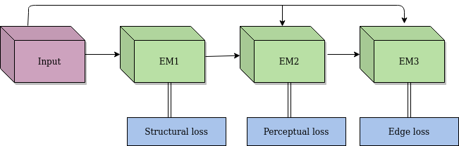
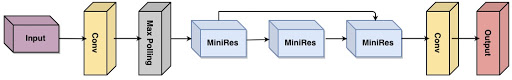

# shadow_pose_estimation
pose estimation with shadow image enhancement
### Usage
- download the **[OTS dataset](https://sites.google.com/view/reside-dehaze-datasets/reside-%CE%B2)** and put the dataset in your desired path.
- set up the image path in both data_load.py and train.py (specifically the [im_path](https://github.com/xiaxx244/shadow_pose_estimation/blob/4f85ab103af261955c54a4828596a00089156778/image_enhancement/train.py#L194), [img_B path](https://github.com/xiaxx244/shadow_pose_estimation/blob/7771c474cc3ce62ca5067c07dcfb73fb46509d8a/image_enhancement/train.py#L149) in both of the two files)
- setup the [save path](https://github.com/xiaxx244/shadow_pose_estimation/blob/13996779ee5dff79e1ec4d612358442a7fd85112/image_enhancement/train.py#L139) for model
- train image enhancement model model by running command 
```
cd image_enhancement
python3 train.py
```
- put the test image path in your desired path
- modifiy the path for test images and saved model in test.py
- run test.py py to run the inference results for image enhancement
- if you need to run pose estimation results on enhanced images, please run the command
```
cd pose_estimation
python3 get_pose.py
```
### Image Enhancement Network Design
#### Overall arch
 

#### EM arch
 

### System setup
 

### Acknowledgements
- https://github.com/CMU-Perceptual-Computing-Lab/openpose
- https://github.com/xahidbuffon/tf-pose-estimation
- https://sites.google.com/view/reside-dehaze-datasets/reside-%CE%B2

