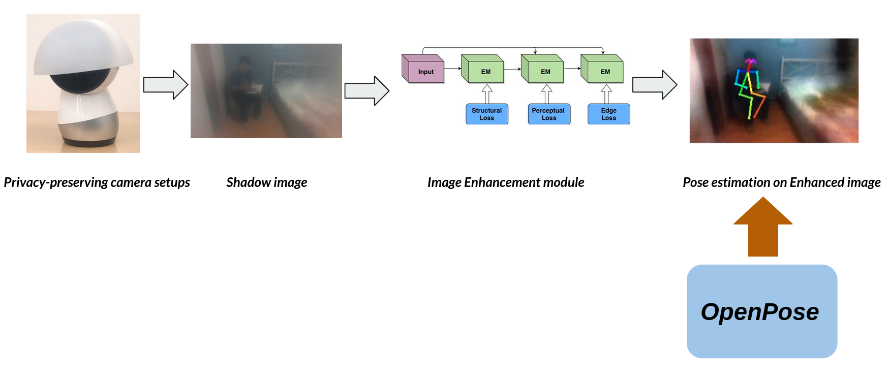

# shadow_pose_estimation
pose estimation with shadow image enhancement
### Usage
- download the **[OTS dataset](https://sites.google.com/view/reside-dehaze-datasets/reside-%CE%B2)** and put the dataset in your desired path.
- set up the image path in both data_load.py and train.py (specifically the im_path, img_B path in both of the two files)
- train image enhancement model model by running command 
```
cd image_enhancement
python3 train.py
```
- run test.py py to run the inference results for image enhancement
- if you need to run pose estimation results on enhanced images, please run the command
```
cd pose_estimation
python3 get_pose.py
```
### System setup
 

### Acknowledgements
- https://github.com/CMU-Perceptual-Computing-Lab/openpose
